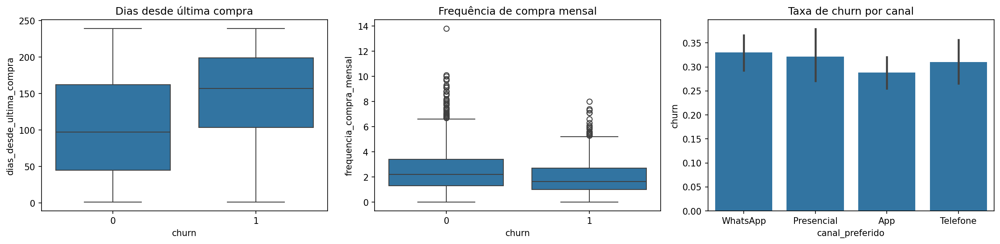
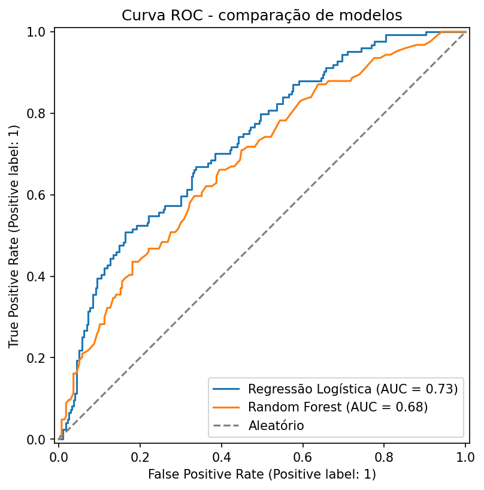
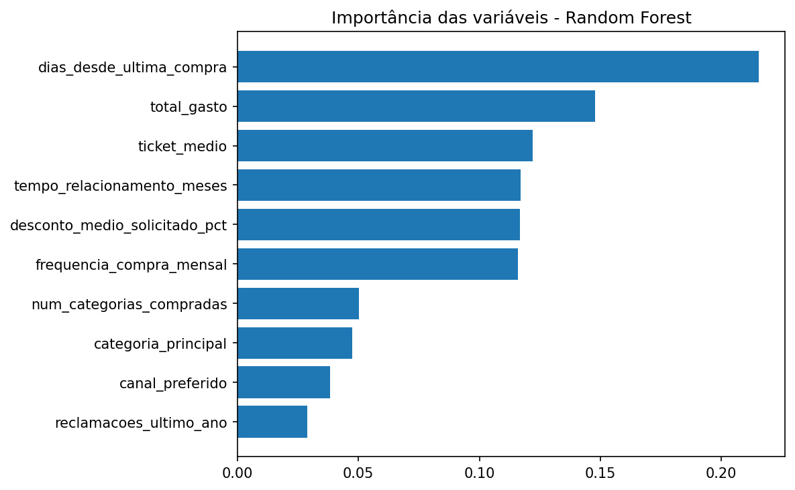

# Previsão de Churn de Clientes

Projeto de portfólio que prevê a probabilidade de um cliente parar de comprar (churn), usando um dataset fictício com comportamento de compra realista. O objetivo não é só treinar um modelo, mas simular um problema real de negócio: identificar clientes em risco antes que eles saiam, pra dar tempo de agir.

Reter um cliente custa bem menos do que conquistar um novo. Um modelo de churn ajuda a área comercial a priorizar contato com quem realmente precisa de atenção, em vez de agir só depois que o cliente já sumiu.

## Dataset

2.000 clientes fictícios, com 31% de taxa de churn. As variáveis simulam informações que uma empresa costuma ter sobre seus clientes:

- `tempo_relacionamento_meses`: há quanto tempo é cliente
- `frequencia_compra_mensal`: quantas compras por mês em média
- `ticket_medio` e `total_gasto`: valor de compra
- `dias_desde_ultima_compra`: recência
- `num_categorias_compradas` e `categoria_principal`: variedade de produtos
- `desconto_medio_solicitado_pct`: percentual médio de desconto pedido
- `reclamacoes_ultimo_ano`: quantidade de reclamações
- `canal_preferido`: canal de atendimento
- `churn`: variável alvo (0 = ficou, 1 = saiu)

## Análise exploratória

As variáveis com relação mais forte com churn foram recência de compra e frequência de compra:

Clientes que deram churn têm mediana de dias desde a última compra bem mais alta, e frequência de compra mensal mais baixa. Já o canal de atendimento não mostrou diferença relevante na taxa de churn entre os grupos, as barras de erro se sobrepõem, então não é um fator determinante nesse dataset.

## Modelagem

**Baseline: Regressão Logística.** Escolhida como primeiro modelo por ser simples de interpretar, o que importa tanto pra validar o resultado quanto pra explicar pra área de negócio o que está pesando na decisão.

Na primeira rodada, o recall da classe churn ficou em apenas 0.36, o modelo perdia a maioria dos clientes que realmente iam sair. O motivo é o desbalanceamento das classes (69% ficam, 31% saem). Ajustando o modelo com `class_weight='balanced'`, o recall da classe churn subiu para 0.65, às custas de uma acurácia geral menor (de 0.74 para 0.67). Essa troca é intencional: deixar passar um cliente que ia sair custa mais caro pro negócio do que fazer um contato desnecessário com quem ia ficar.

**Comparação com Random Forest.** Testado como segundo modelo, mais complexo, pra ver se melhorava o resultado. Não melhorou: recall de 0.32 e AUC de 0.68, contra recall de 0.65 e AUC de 0.73 da regressão logística.

A regressão logística venceu porque o `class_weight='balanced'` age direto na função de perda do modelo, enquanto no Random Forest ele age por árvore, o que corrige menos bem o desbalanceamento nesse cenário. Fica o modelo mais simples como escolha final, tanto pelo desempenho quanto pela interpretabilidade.

## Resultado final (Regressão Logística com class_weight balanced)

| Métrica | Classe churn (1) |
|---|---|
| Precisão | 0.47 |
| Recall | 0.65 |
| AUC | 0.73 |

## O que mais pesa na decisão

Os coeficientes da regressão logística confirmam o padrão visto na análise exploratória:

- **Recência de compra** é o maior fator de risco. Quanto mais tempo sem comprar, maior a chance de churn.
- **Frequência de compra** é o maior fator de retenção. Clientes que compram com mais regularidade têm bem menos chance de sair.
- Reclamações no último ano também pesam, mas com menos força que os dois fatores acima.

Na prática, isso sugere um gatilho simples pro time comercial: cliente que passa muito tempo sem comprar é o sinal de alerta mais confiável pra agir antes de perdê-lo de vez.

## Do modelo à ação: ranking de risco por cliente

Prever churn como 0 ou 1 tem uso limitado sozinho. O que uma área comercial realmente usa é uma lista de clientes ordenada por probabilidade de saída, pra saber por quem começar. Por isso o modelo também gera a probabilidade de churn de cada cliente (`predict_proba`), não só a classificação binária, e essa probabilidade é traduzida em três faixas de risco:

| Faixa de risco | Clientes (base de teste, n=400) |
|---|---|
| Alto (≥ 70%) | 65 |
| Médio (40–70%) | 177 |
| Baixo (< 40%) | 158 |

Nos 15 clientes de maior risco, 10 realmente deram churn, o que mostra que mesmo sem ser perfeito, o modelo concentra bem o esforço comercial: ligar pra esses clientes é bem mais eficiente do que contatar a base toda de forma aleatória. O ranking completo está em `ranking_risco_churn.csv`.

## Próximos passos

- Testar outros modelos (XGBoost, LightGBM) e técnicas de balanceamento como SMOTE
- Incluir variáveis de sazonalidade e histórico de interação com atendimento
- Transformar o modelo em um dashboard de acompanhamento de clientes em risco

## Ferramentas

Python, pandas, scikit-learn, seaborn, matplotlib, Google Colab
